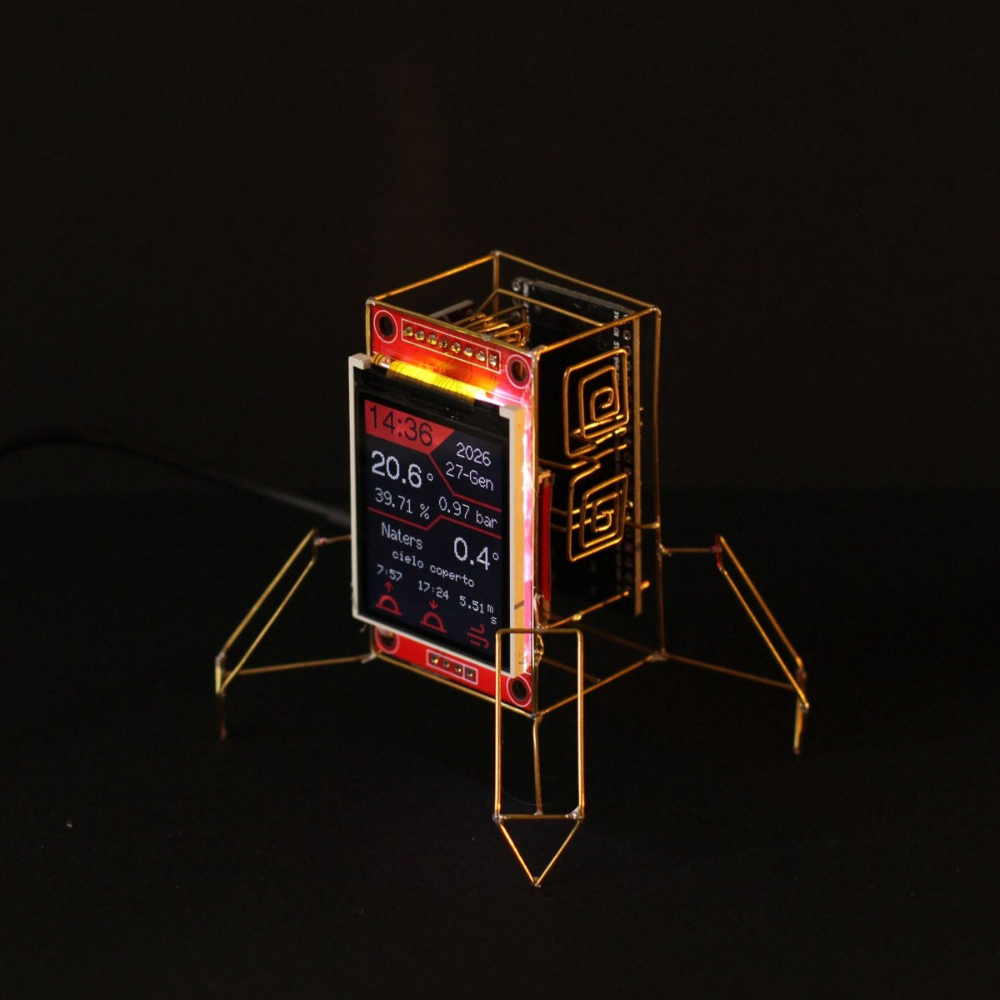
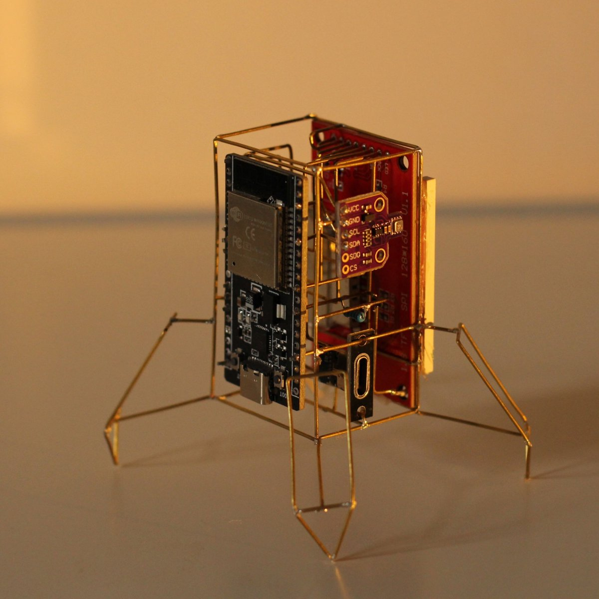

# Lander Ino V2

Second-generation build of the lander-shaped desktop weather station and clock, powered by an ESP32. It builds on [Lander-Ino](https://github.com/AlBarbe/Lander-Ino) with an upgraded environmental sensor, touch controls, and a smooth dimmable backlight.

<p align="center">
  
  
</p>

## Overview

The display shows:
- Current time and date, kept in sync over Wi-Fi via NTP
- Indoor temperature, humidity, pressure and gas resistance, read from an onboard BME680 sensor
- Outdoor weather (temperature, humidity, description, sunrise/sunset, wind speed) fetched from the [OpenWeatherMap](https://openweathermap.org/api) API

Everything is drawn on a small color TFT display mounted on a wireframe "lander" frame with four legs.

## What's new vs. V1

- **BME680 sensor** (temperature, humidity, pressure, gas resistance) replaces the BMP280
- **Two capacitive touchpads**: one cycles the backlight brightness (and turns the screen off at the lowest step), the other cycles through display color themes
- **Non-blocking backlight fade** (`noblock_led.h`) for smooth on/off/brightness transitions instead of an instant switch
- **Longer city names** supported in the weather layout

## Hardware

- ESP32 dev board (`nodemcu-32s`)
- TFT display (ST7735/ST7789) driven by [TFT_eSPI](https://github.com/Bodmer/TFT_eSPI)
- BME680 environmental sensor (I2C, address `0x77`)
- 2x capacitive touchpads (GPIO32 / GPIO33)
- PWM-dimmable backlight (GPIO16)
- Custom hand-bent wire "lander" chassis

## Firmware

Built with [PlatformIO](https://platformio.org/) (`framework = arduino`).

Dependencies (see `platformio.ini`):
- Adafruit ST7735 and ST7789 Library
- TFT_eSPI
- ArduinoJson
- Adafruit BME680 Library

## Project structure

```
src/main.cpp                  setup/loop: Wi-Fi, touchpad/sensor/weather refresh timers
include/My_Lander_Display.h   Lander_Display class, draws clock/date/sensor/weather on the TFT
include/My_Weather.h          weatherData class, parses the OpenWeatherMap JSON payload
include/My_Time_Config.h      MyClock class, NTP time sync + day/month name helpers
include/My_Touchpad.h         Touchpad class, wraps touchRead() with touched/released/kept edge detection
include/noblock_led.h         nb_led class, smooth non-blocking backlight fade via analogWrite
```

## Controls

| Touchpad | Pin | Action |
|---|---|---|
| Pad 1 | GPIO32 | Cycle backlight brightness; screen turns off at the lowest step, next tap turns it back on |
| Pad 2 | GPIO33 | Cycle through display color themes |

## Configuration

Before building and flashing, edit `src/main.cpp` and set your own values:

```cpp
#define WIFI_SSID       "WIFI_NAME"
#define WIFI_PASSWORD   "WIFI_PASSWORD"

String openWeatherMapApiKey = "API-KEY";
String city = "YOUR_CITY";
String countryCode = "YOUR_COUNTRY_CODE";
```

## Build & flash

```bash
pio run --target upload
```
